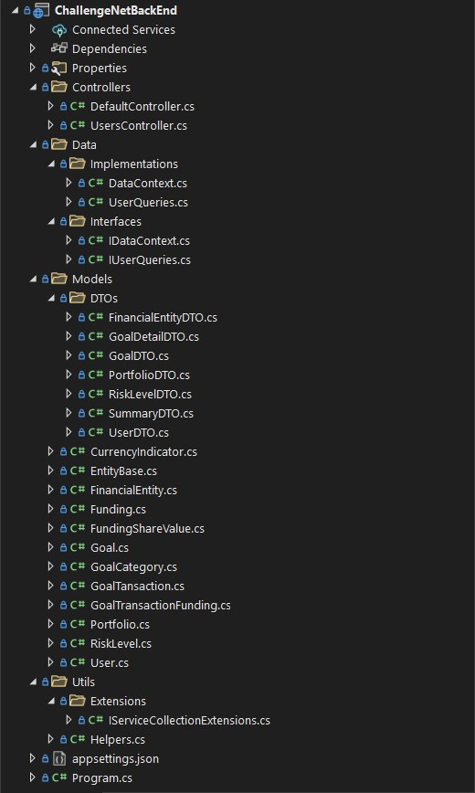

# Challenge NET Back-end
Proyecto desarrollado para proceso de reclutamiento. 

## Descripción de la funcionalidad principal del proyecto

Se requiere mediante la creación de servicios Web en tecnologías Api-Rest o GRPC-
WEB, una aplicación que exponga a través de internet una serie de endpoints.

La aplicación debe estar en C#, .NET Core con EF Core utilizando LINQ o raw Sql.

Los endpoints necesarios son:
<ol>
  <li>
    <b> Traer un usuario:</b>
    <ul>
      <li> path : /users/{id}</li>
      <li> salida : Id, nombre completo , nombre completo del Advisor, Fecha de creación.</li>
    </ul>
  </li> 
  <li>
    <b>Traer el resumen del usuario actual (considerar moneda)*</b>
    <ul>
      <li>path: /users/{id}/summary</li>
      <li>salida: balance, aportes actuales</li>
    </ul>
  </li>
  <li>
    <b>Traer el resumen del usuario actual a una fecha (considerar moneda)*</b>
    <ul>
      <li>path: /users/{id}/summary/{dd-mm-yyyy}</li>
      <li>salida: balance, aportes totales.</li>
    </ul>
  </li>
  <li>
    <b>Traer metas de un usuario</b>
    <ul>
      <li>path: /users/{id}/goals</li>
      <li>salida: Titulo de meta, años, inversión inicial, aporte mensual, monto objetivo, Entidad financiera, portafolio completo, fecha de creación.</li>
    </ul>
  </li>
  <li>
    <b>Traer detalle de una meta</b>
    <ul>
      <li>path:/users/{id}/goals/{goalId}</li>
      <li>salida: Titulo de meta, años, inversión inicial, aporte mensual, monto objetivo, categoría de la meta, Entidad financiera, portafolio completo, total aportes, total retiro, porcentaje de cumplimiento de la meta.</li>
    </ul>
  </li>
</ol>  
 
## Estructura del proyecto
El proyecto está estructurado de la siguiente manera: 



Consta de las siguientes carpetas:

- <b>Controllers:</b>  En esta carpeta están los controladores que sirven los endpoints al usuario.
- <b>Data:</b> Acá se realiza la interacción la base de datos, internamente tenemos las carpetas <i>Interfaces</i> y <i>Implementations</i>, en la primera tenemos la firma de los metodos a implemetar tanto para DataContext como para UserQueries. 
Esto con el fin de facilitar la inyección de dependencia.
- <b>Models:</b> Se definen las entidades que reprensentan las tablas de la base de datos en el proyecto. Adicionalmente, está la carpeta <i>DTOs</i> donde se encuentran las clases que con la estructura de los datos requeridos en los endpoints.
- <b>Utils:</b> Carpeta de utilitarios.
 

## Como ejecutarlo

El proyecto está desarrollado en VS 2022 con NET6, por lo que es necesario tener esta versión instalada para poder ejecutar en proyecto de manera local.

Solamente se requiere descargar el código fuente del repositorio con el siguiente comando de git:
``` 
git clone https://github.com/ftinoco/challenge-net-back-end.git 
``` 
una vez descargado, proceder a abrir el proyecto en VS y compilarlo con el fin de descargar e instalar los paquetes necesario para que la aplicación se ejecute. 

Posterior a esto, se ejecuta el proyecto el cual está configurado para correr con Kastrel por defecto, en la ruta https://localhost:7187 y la cual mostrará en el navegador la siguiente pantalla:


El proyecto cuenta con dos controladores, <i>Default</i> que tiene como fin permitir probar las conexiones a la base de datos y validar si el API esta ejecutando y <i>Users</i> es el controlador con las funcionalidades requeridas por el challenge.

## Disponibilidad

Como parte del challenge, es necesario que la aplicación esté accesible desde internet, por lo que fue publicado en Azure, 
y se puede acceder a través de la siguiente URL: [challengenetbackend.azurewebsites.net](https://challengenetbackend.azurewebsites.net/)

Para verificar si el servicio está ejecutando se puede probar el endpoint [ping](https://challengenetbackend.azurewebsites.net/ping) el cual debería retornar como mensaje <b><i>pong</i></b>. Para verificar si hay conexión a la base de datos
se puede realizar a través de [canConnect](https://challengenetbackend.azurewebsites.net/canConnect) el cual debería responder con <b><i>connected!</i></b>.

## Notas del Release

- Para el segundo punto de requerimiento, se esta utilizando la fecha actual para obtener la tasa de conversión por lo que es probable que se obtenga 0 como valor para balance y aporte, sino hay valores para la fecha actual en la tabla CurrencyIndicator.
- Para el tercer punto se está reutilizando la funcionalidad del segundo punto, por lo que si no existe tasa de conversión para la fecha proporcionada los valores serán 0 para balance y aporte. 
